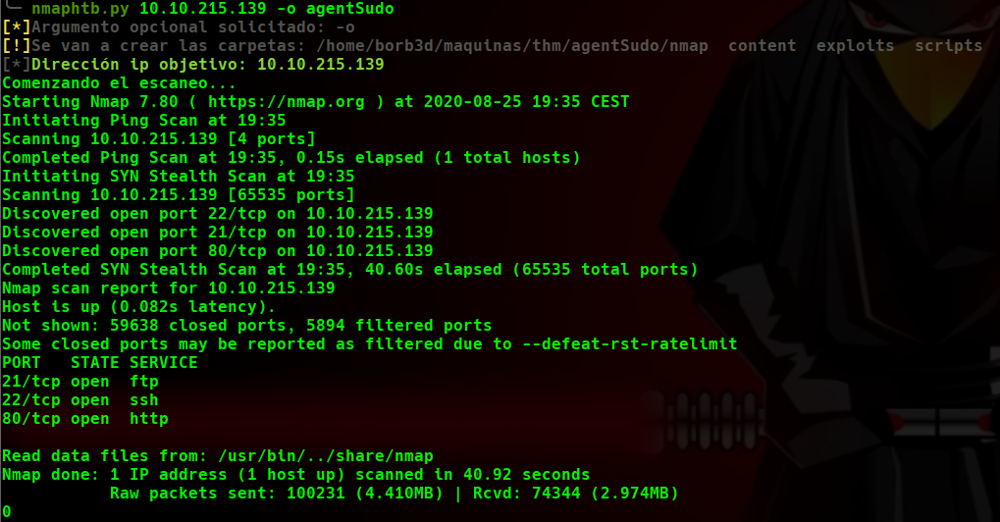

# Agent Sudo WriteUp
Volver al [Indice](README.md)

Comenzamos con mi primera WriteUp, en este caso vamos a realizar una prueba a la máquina "Sudo Agent" de TryHackMe, está clasificada con nivel "Easy" dentro de esta plataforma.
Espero que por favor me mandéis diferentes críticas para saber si os gusta la forma de explicar, la variedad, estilo...etc y como podría mejorar.

----------------------------------------------------------------------------------------------------------------------------------------------------------------------

Primero comenzamos lanzando un escaneo a la ip de la máquina a todos los puertos (voy a usar una utilidad que creé en Python3 que me lanza un comando de nmap y me crea diferentes directorios para poder ser más ordenado a la hora de trabajar, la herramienta está bastante verde y seguramente deje de usarla pero de momento es cómoda por la creación de los directorios), dejo aquí la sintaxis por si os interesa.
*  nmaphtb.py "ipVictima" -o "nombre del directorio raiz"
    *  Crea la carpeta que se puso en el parámetro -o con los "subdirectorios" content, nmap, exploits, scripts, si no se le indica parámetro deja el archivo con el escaneo en el directorio actual.
    *  Lanza el comando: nmap "ipVictima" -p- --open -T5 -v -n -oG "Ruta a carpeta nmap/allports"

