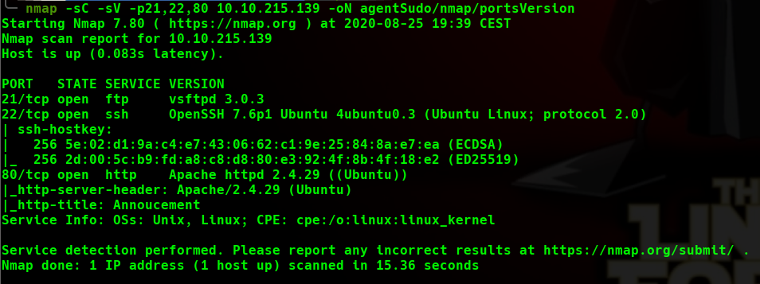
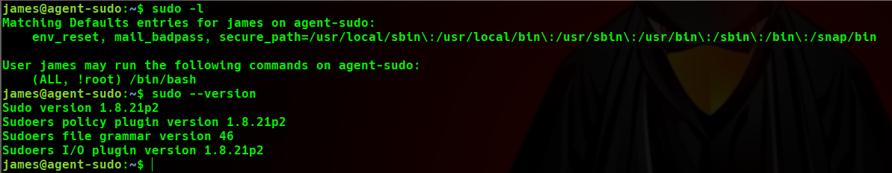

# Agent Sudo WriteUp
Volver al [Indice](README.md)

Comenzamos con mi primera WriteUp, en este caso vamos a realizar una prueba a la máquina "Sudo Agent" de TryHackMe, está clasificada con nivel "Easy" dentro de esta plataforma.
Espero que me mandéis diferentes críticas para saber si os gusta la forma de explicar, la variedad, estilo...etc y como podría mejorar.

----------------------------------------------------------------------------------------------------------------------------------------------------------------------

Primero comenzamos lanzando un escaneo a la ip de la máquina a todos los puertos (voy a usar una utilidad que creé en Python3 que me lanza un comando de nmap y me crea diferentes directorios para poder ser más ordenado a la hora de trabajar, la herramienta está bastante verde y seguramente deje de usarla pero de momento es cómoda por la creación de los directorios), dejo aquí la sintaxis por si os interesa.
*  nmaphtb.py "ipVictima" -o "nombre del directorio raiz"
    *  Crea la carpeta que se puso en el parámetro -o con los "subdirectorios" content, nmap, exploits, scripts, si no se le indica parámetro deja el archivo con el escaneo en el directorio actual.
    *  Lanza el comando: nmap "ipVictima" -p- --open -T5 -v -n -oG "Ruta a carpeta nmap/allports"

Después de realizar el escaneo vemos que tiene 3 puertos abiertos (21, 22 y 80), en este caso vamos a realizar un escaneo especícifo a estos puertos para ver que servicio llevan y que versiones de los mismos.

Vemos que el puerto 21 de FTP no tiene acceso con usuario Anónimo, por lo que vamos a comprobar que tenemos en el puerto 80 y mientras vamos a dejar lanzada una consulta de directorios en este puerto con "dirsearch" (esta vez he lanzado el comando con -x 403 para no ver las salidas "Forbidden" y tener una salida más clara)

Como vemos en la imagen no hemos encontrado nada interesante ya que el directorio de "login" nos redirecciona al propio index, en el puerto 80 tampoco vimos nada a simple vista pero vamos a mirar más detalladamente a ver si conseguimos captar algo.

Revisando lo que nos muestra la página inicial, nos dice que usemos nuestro propio "Codename" como "user-agent", este "user-agent" me recuerda al agente que usan los navegadores, probamos a crear un agente nuevo con simplemente la letra C (yo he usado el complemento de Chrome llamado “User Agent Switcher” para facilitarlo), también se podría usar directamente desde el inspector de elementos, para ello lo abrimos y seguimos estos pasos:
*  Vamos a la pestaña "Network"
*  Abajo en la pestaña "Network Conditions" (si no lo tenemos podemos sacarlo en los 3 puntitos que hay arriba, more tools y “Network Conditions”)
*  Le damos a "custom" y ponemos C.
Recargamos la página y...Bingo! nos ha redireccionado directamente a un directorio con el siguiente texto:

Vemos que es una carta dirigida a "chris" (ya tenemos un nombre de usuario) y le está diciendo que cambie su contraseña, que es muy débil.
Probamos un ataque de fuerza bruta con "hydra" hacia el servicio de FTP, que sabemos que está abierto.

[hydra](images/agentSudo/hydraFTP.png)

Bien hemos conseguido las credenciales para acceder al servidor de FTP.
Cuando accedemos vemos 3 archivos (2 imágenes y 1 documento de texto), los descargamos a nuestro equipo con el comando GET.

Al revisar el archivo .txt vemos que es una carta dirigida al AgenteJ, parece que vamos a tener que hacer algo de Stego a las imágenes.

Usamos la herramienta "binwalk" con el parámetro -e (para extraer lo que encuentre) a la imagen "Cutie.png" y encontramos que dentro tiene varios ficheros, la otra imagen no contiene nada de momento.

Como vemos, encontramos varios ficheros, los vamos revisando todos y vemos que el archivo .zip está encriptado, lo pasamos a un formato que John pueda entender para poder desencriptarlo.

Ahora sí, podemos pasarle a John el fichero con el hash que hemos conseguido.

Descomprimimos el archivo .zip con la contraseña que hemos encontrado para poder visualizar el contenido correctamente.

La carta que hemos encontrado contiene el siguiente texto, en el nos dice que tenemos que mandar la imagen a 'palabra encriptada' lo antes posible.

Para poder saber "a donde" tenemos que enviar la imagen tenemos que decodificar la palabra, que está en Base64.

Usamos la contraseña obtenida para poder extraer los archivos ocultos dentro de la imagen que nos queda.

Con la contraseña que hemos obtenido en la carta anterior vamos a probar credenciales en el servidor SSH.
Conseguimos loguearnos con el usuario "james" y ahí tenemos la flag de user.

Para conseguir llegar a la flag de Root vamos a realizar primero el comando "sudo -l" para ver los privilegios que tiene este usuario como root y vemos que tiene los privilegios del comando "sudo" por lo que vamos a ver que versión de éste.

Vemos que tiene la versión 1.8.21p2, buscando por Google encontramos que tiene una vulnerabilidad para realizar un ByPass y escalar privilegios, lanzamos el comando y listo, ya somos Root.

Como bonus decir que esta máquina tiene una pregunta, nos dice que ¿Quién es el Agente R?
Bueno, si somos observadores lo tenemos a simple vista, lo dejo ahí.

Espero que os haya gustado mi primer WriteUp y lo dicho, estoy a vuestra disposición para que me reportéis vuestras opiniones.

Un saludo, gracias por quedaros hasta el final, y ¡hasta la próxima!