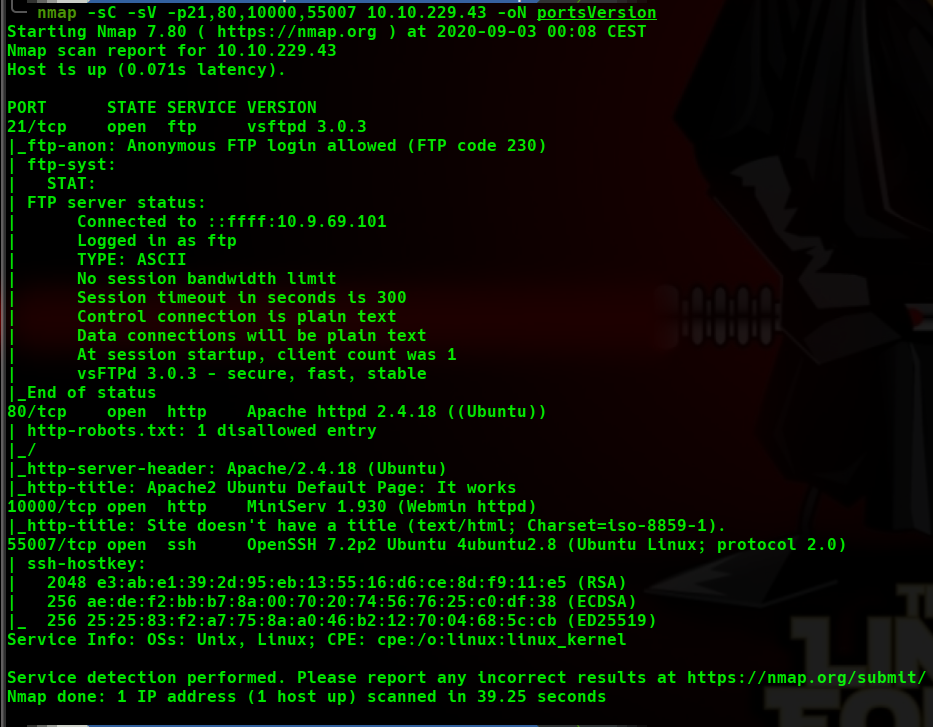
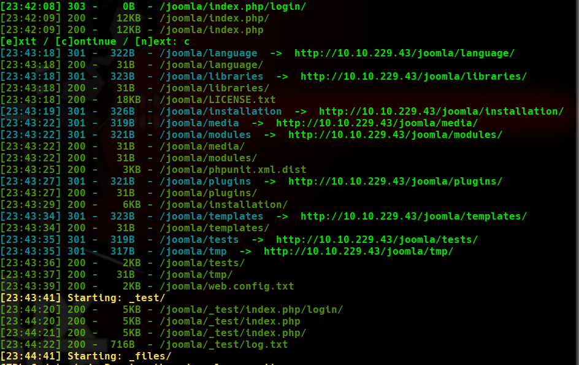
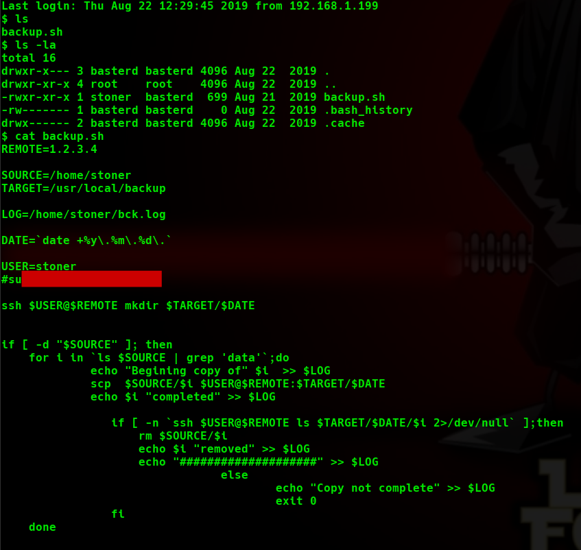
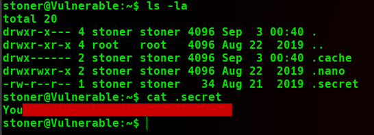

# BoilerCTF WriteUp
Volver al [Indice](README.md)

Hoy traigo una máquina de THM de nuevo, está creada por el usuario "MrSeth6797" y tiene una dificultad de "Medium" y en ella deberemos descifrar una frase para encontrar una pista donde nos indique por donde tenemos que tirar y seguir enumerando la máquina para poder escalar a un usuario con shell y encontrar un binario con SUID para poder realizar el privesc.

----------------------------------------------------------------------------------------------------------------------------------------------------------------------
## *# Enumeración*
Comenzamos enumerando la máquina con nmap a los puertos que hemos encontrado, esta vez dejo simplemente el escaneo a los puertos directamente.
* 21 => Un servidor FTP con acceso anónimo activado
  * Tenemos dentro un fichero, nos lo llevamos a nuestra máquina atacante.
* 80 => Vemos una página inicial sin nada relevante de primeras.
* 10000 => Un Webmin que no tenemos credenciales aún.
* 55007 => Un ssh en un puerto bastante alto.



**Webmin**


Le echamos un ojo al fichero que nos hemos traido del FTP y vemos que está cifrado en el cifrado César, despues de descifrarlo tenemos lo siguiente:
>Just wanted to see if you find it. Lol. Remember: Enumeration is the key!

Como vemos, nos dice que la enumeración es la llave...  
Dejamos a dirsearch trabajando a ver que nos encuentra.



Vemos un directorio con código 200 que nos llama la atención, "_test", con uno detrás llamado "log.txt", accedemos a el y vemos unas credenciales en texto plano.


## *# Explotación*
Probamos las credenciales encontradas en el puerto alto que encontramos de SSH y...¡Estamos dentro!  
Pero, el usuario con el que accedemos no tiene shell. Sin problema, en el mismo directorio encontramos un archivo "backup.sh", con unas credenciales en texto plano de otro usuario.



Accedemos vía SSH con este nuevo usuario y ahora si, cogemos la flag de User.



## *# Post-Explotación*
Hacemos una enumeración básica del sistema y vemos que hay un binario ```"find"``` con SUID activado...  
Vamos a [GTFOBins](https://gtfobins.github.io/) , buscamos el binario y lo explotamos.


¡Somos ROOT!
