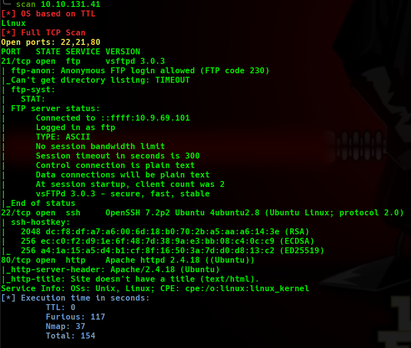
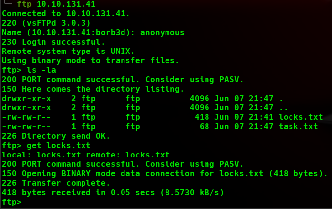
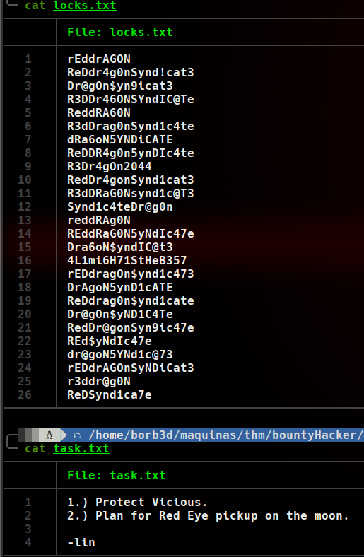
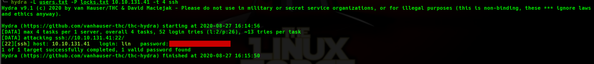
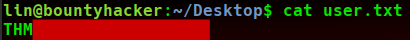
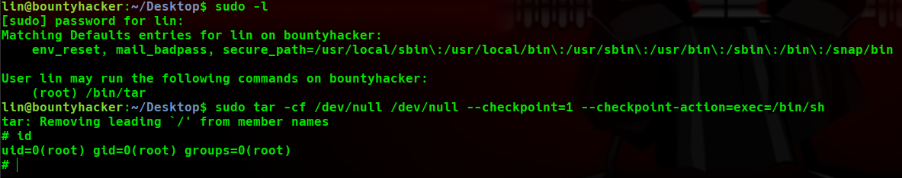
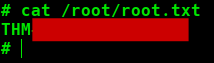

# Bounty Hacker WriteUp
Volver al [Indice](README.md)

Seguimos con la segunda WriteUp, seguimos en la plataforma THM con la máquina "Bounty Hacker", también poseé una calificación de "Easy" dentro de la plataforma.

----------------------------------------------------------------------------------------------------------------------------------------------------------------------
## *# Enumeración*
Bueno para comenzar, esta vez vamos a probar una herramienta de CybexSec (comunidad creada por Takito), llamada “scan”, esta herramienta es un escaner bastante automatizado, voy a explicar un poco lo que hace para que nos entendamos.
La sintaxis es muy sencilla, simplemente hay que poner “scan ”ipVictima" y ya se realizaría todo.
Dejo aquí el enlace de su página por si queréis probarla (ahí indican como instalarla y todo).
[scan](https://cybexsec.es/scripts-para-el-recon-de-una-maquina/)
* El primer paso tira un ping a la ip objetivo a fin de determinar si se trata de un sistema Linux, Windows, Cisco ó desconocido si no es capaz de determinar su OS.
* El segundo paso realiza un escaneo a los 65535 puertos con la herramienta “furious” (que suele ser más rápida que nmap).
* El tercer y último paso toma como referencia los puertos encontrados con la herramienta anterior y realiza un escaneo con nmap para determinar los servicios y versiones existentes en estos puertos.
También decir que todo esto lo reporta de una forma muy visual.

Para este caso voy a dar una crítica a la herramienta totalmente personal, no he encontrado opción de poder exportarla a un fichero (a menos que se redireccione la salida y vaya todo correcto pero claro no veríamos nada por pantalla) así que finalmente le puse en el comando que lanza final de nmap un parámetro que me exportase ese archivo y almenos tener exportado el fichero con los puertos y sus versiones que es lo más relevante (-oN), en cuanto al tiempo que teóricamente tiene que ir mucho más rápido, en este caso para mi no ha sido el caso, el escaneo con “scan” me tardó 154 segundos según la misma aplicación, como podéis ver, y yo haciendo manual los comandos típicos de nmap a todos los puertos y luego lanzando otro nmap para sacar las versiones de los puertos tardé 53 segundos.

Como podemos observar en la captura anterior, tiene habilitado el acceso anónimo al FTP por el puerto 21, así que vamos a ver que contiene.
Vemos que tiene 2 ficheros .txt, los descargamos con GET.

Vemos que el archivo "locks.txt" tiene diferentes letras ordenadas de forma que parecen contraseñas, vamos a ver si podemos hacer algo con ello más adelante.
En el fichero "task.txt" contiene una lista de tareas que les queda por realizar. Lo único que podemos sacar de ahí relevante son 2 nombres, vicious y lin, los añadimos a un fichero .txt y los guardamos.

Viendo que tenemos 2 ficheros que contienen lo que parece son, contraseñas y algún posible usuario, vamos a realizar un ataque de fuerza bruta con hydra mientras vemos otros vectores de ataque. 
Pero a nuestra sorpresa, la fuerza bruta a acabado en menos de 1 minuto, encontrándonos las credenciales que necesitamos!

## *# Explotación*
Usamos las credenciales obtenidas para acceder via SSH a la máquina y ya tendríamos directamente la flag de User.

## *# Post-Explotación*
Vamos a comenzar con la escalada de privilegios, lanzamos con el usuario que disponemos el comando "sudo -l" para ver los privilegios que poseemos como root, vemos que tiene privilegios del comando "tar", así que vamos a explotarlo.
¡Somos ROOT!

Buscamos la flag de root en su directorio y listo, hemos completado la máquina.

