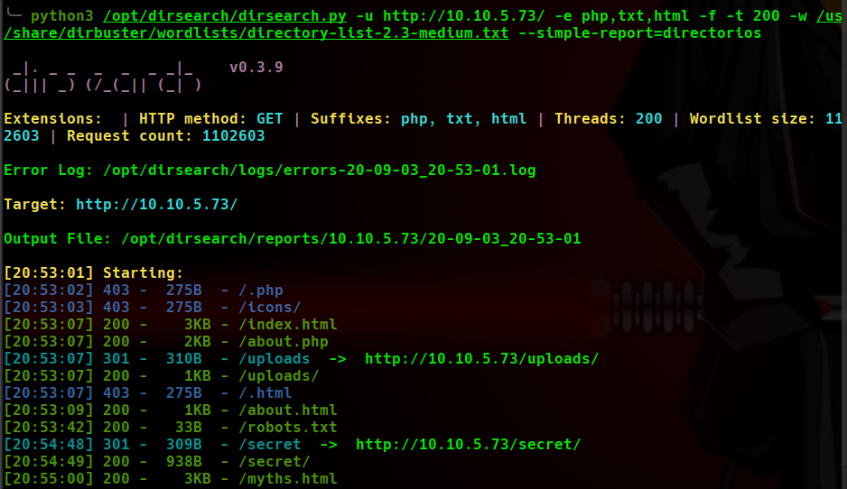
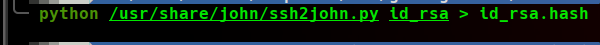

# GamingServer WriteUp
Volver al [Indice](README.md)

Volvemos con una de las últimas máquinas, ha sido creada por el usuario "SuitGuy" y tiene una dificultad de "easy".  
En este caso veremos como poder aplicarle fuerza bruta a un "passphrase" de SSH con nuestro amigo "john" y explotar un servicio "lxd".

----------------------------------------------------------------------------------------------------------------------------------------------------------------------
## *# Enumeración*
Comenzamos realizando una enumeración de todos los 65535 puertos con nmap y recopilando información de los servicios y aplicaciones que contienen estos puertos.


Vemos que simplemente tenemos 2 puertos abiertos de los cuales no podemos explotar sin entrar más en profundidad en ellos.
En el código fuente de la página http principal, al final de este, vemos un comentario hacia una persona "john". Parece que ya tenemos un usuario por ahí.  


Al no encontrar nada más a simple vista lanzamos una búsqueda con dirsearch para poder enumerar un poco más los directorios que esta página contiene.



Comenzamos a enumerar los directorios que nos ha encontrado dirsearch.
* robots.txt => Contiene un directorio llamado "/uploads/" así que entramos y vemos que contiene 3 archivos.
   *  dict.lst => Parece un diccionario por lo que los descargamos y lo dejamos guardado para realizar fuerza bruta después por si fuese necesario.


   *  manifesto.txt => Es simplemente un texto al que no podemos sacarle demasiado provecho.
   *  meme.jpg => Una imagen a la que de momento no vamos a echarle mucha cuenta (ya que tenemos un diccionario y un posible usuario)
* secret => Contiene un archivo llamado "secretkey" con una id_rsa como contenido, así que ¡perfecto! lo descargamos e intentamos acceder vía ssh.


Al intentar acceder mediante el usuario "john" y la id_rsa que hemos conseguido nos pide una "passphrase" para poder acceder a la máquina... Creo que es momento de emplear el diccionario que dejamos de lado.  
Para poder pasar esta key "id_rsa" a un formato al que john pueda entenderlo vamos a emplear la herramienta "ssh2john".  
Simplemente le pasamos el archivo con la key a esta herramienta y sacamos el resultado saliente en otro archivo diferente.
``` python ssh2john.py id_rsa > id_rsa.hash ```



Ya tenemos nuestra key en un formato para john, así que vamos a pasarselo a ver que nos encuentra.
``` john id_rsa.hash --wordlist=dict.lst ```


## *# Explotación*
¡Enhorabuena! hemos conseguido la llave para acceder a nuestro objetivo. Accedemos vía ssh con la id_rsa y su passphrase y visualizamos la flag de user.


## *# Post-Explotación*
Al comenzar la escalación de privilegios realizo el comando "id" para ver que usuario somos y a que grupo pertenecemos, y veo que formamos parte del grupo "lxd" el cual es un "hipervisor" para contenedores (tipo docker) de Linux el cual mediante un repositorio (saghul) podemos explotarlo y hacernos con ese premio llamado "ROOT".


[https://www.hackingarticles.in/lxd-privilege-escalation/](https://www.hackingarticles.in/lxd-privilege-escalation/)

Simplemente siguendo este artículo que os he dejado arriba conseguiremos ser ROOT (aconsejo leerselo detenidamente y/o revisar que es, para que sirve y como funciona lxd para poder entender bien la explotación)


Como siempre y una vez más....¡Somos ROOT!