# Ghizer WriteUp
Volver al [Indice](README.md)

Vamos a darle hoy un par de vueltas a la máquina ¡Ghizer!, creada por "Stuxnet", tiene una dificultad de "Medium" y en ella vamos a explotar varias cositas.  
Veremos como explotar una aplicación de encuestas llamada "LimeSurvey", entraremos en un "rabbit hole" con un wordpress (posteriormente Stuxnet me dijo que no, que de aquí se puede avanzar) y lo más complicado,explotaremos Ghidra a través de jdb (Java Debugger) aprovechándonos de una vulnerabilidad.  
Hecho esto, la escalada de privilegios es sencilla.

----------------------------------------------------------------------------------------------------------------------------------------------------------------------
## *# Enumeración*
Para no perder la costumbre, comenzamos enumerando todos los puertos de la máquina en búsqueda de servicios.

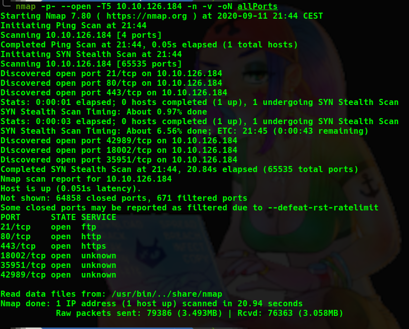
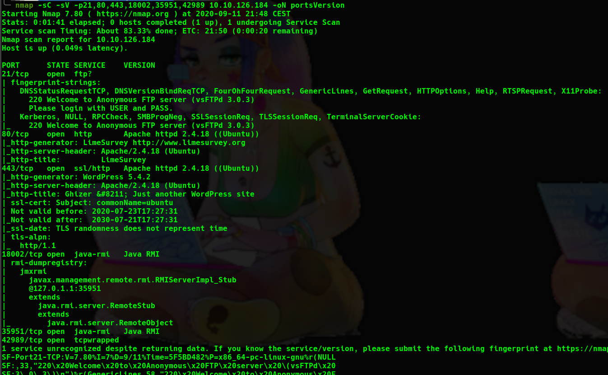

Tenemos bastantes puertos abiertos, así que vamos a pararnos y ver que podemos hacer.
* 21 ==> Un ftp, conseguimos loguearnos mediante usuario anónimo pero no conseguimos descargar ningún archivo.
* 80 ==> Contiene una página http con una aplicación llamada "LimeSurvey" ahora la enumeraremos.
* 443 ==> Contiene un WordPress. Entraremos más en detalle.
* 18002 ==> Tiene un Java RMI, no vamos a mirar nada ahí de momento.

En el puerto 80 tenemos la aplicación que ya hemos mencionado, LimeSurvey, vamos a ver si conseguimos encontrar la versión para buscar algún exploit, mediante dirsearch y enumerando un poco encontramos el archivo ```/docs/release_notes.txt```.

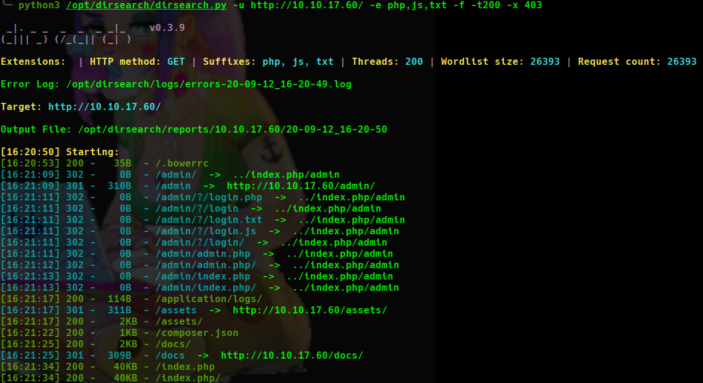

En él encontramos la versión de esta aplicación.

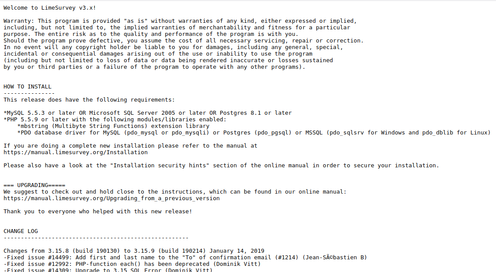

Buscamos algún exploit con ```"searchsploit"``` y encontramos un exploit que permite la ejecución remota de código.

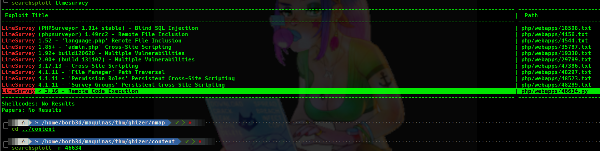

Lo examinamos y nos devuelve una shell, pero es un exploit autenticado...

## *# Explotación*
Realizando una búsqueda por Google, encontramos las credenciales por defecto y las probamos, ¡Bingo! estamos dentro.

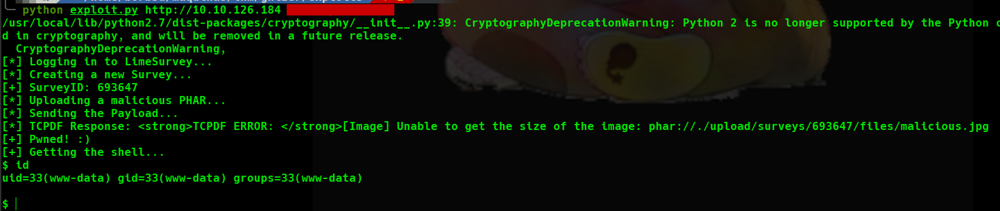

Una vez dentro intentamos sacarnos una shell interactiva pero se queda bloqueado así que como en THM nos pregunta las credenciales del archivo de configuración vamos a ello.  
Volviendo a realizar una búsqueda por Google encontramos la ruta del archivo de configuración, así que lo buscamos y perfecto, ahí tenemos la respuesta a la pregunta del compañero Stuxnet.

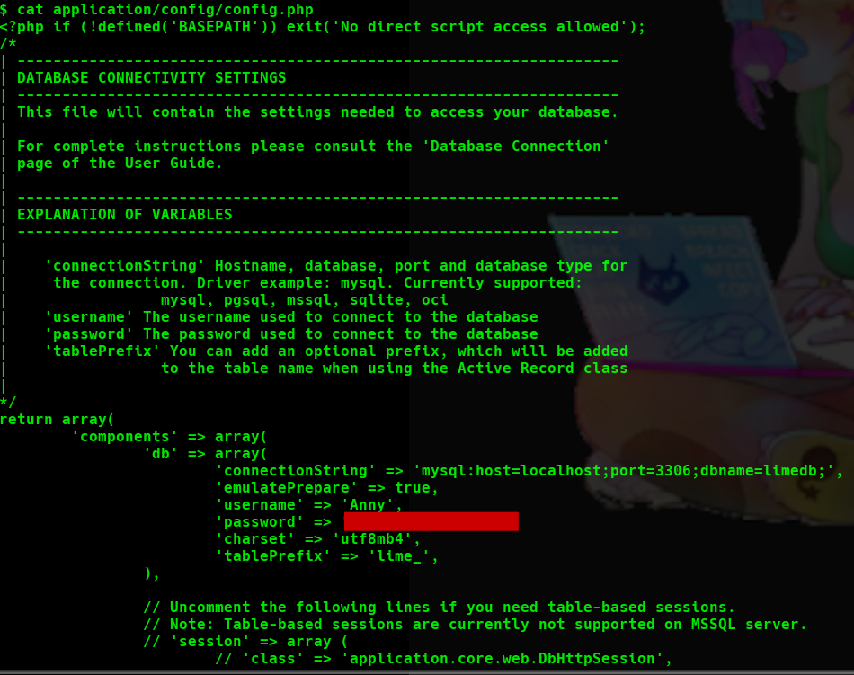

## *# Enumeración*
Ya con las credenciales procedemos a probarlas en el Wordpress, pero nos dice en la página principal que la ruta "wp_admin" está protegida para difultar su búsqueda. Sin problema, más abajo tenemos el botón "Log in", cual nos redirecciona a esta ruta.  

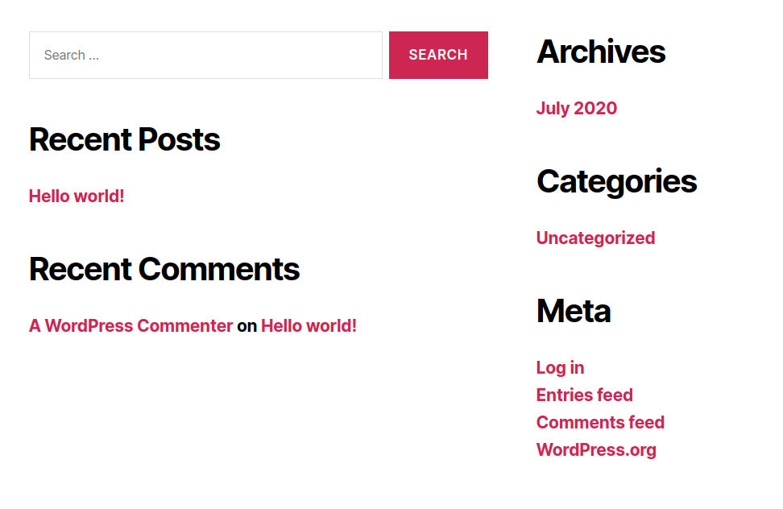

Ya dentro del panel de Wordpress, miramos cual es el tema que estamos usando y colocamos una reverse shell en archivo 404.php para no molestar en el caso de que fuese un entorno real.


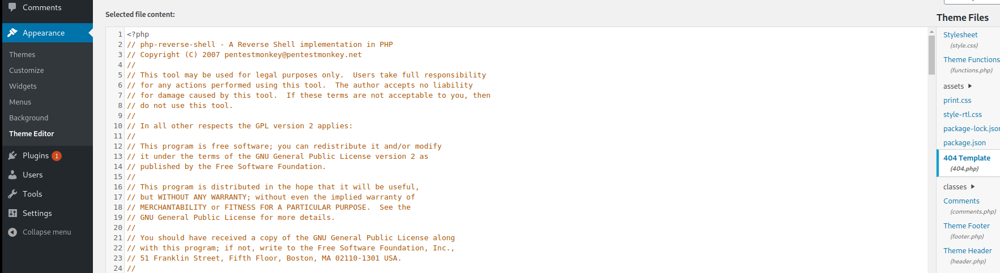

Pero ¡NO!, nos da un error y no podemos acceder mediante este método.  
Después de enumerar el WordPress, nos damos cuenta de que hemos llegado a un "Rabbit Hole"...  

## *# Explotación2*
Volvemos a nuestra "shell" en el puerto 80 que conseguimos anteriormente y nos lanzamos una ReverseShell de python (ya que sabemos que está python instalado) y ahora sí, podemos escalarnos a una shell interactiva del usuario www-data.  
Ahora bien, vamos al directorio home del usuario Verónica y vemos que vamos a tener que escalar privilegios a este usuario ya que no podemos coger su flag.  
En este directorio vemos una carpeta de ```"ghidra"``` con su versión

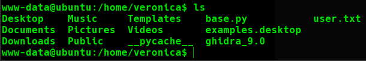

Vamos a ver como explotarlo. Búscando por Google encontré una página que detalla bastante fácil su ejecución.

[https://github.com/NationalSecurityAgency/ghidra/issues/143](https://github.com/NationalSecurityAgency/ghidra/issues/143)

Vemos que necesitamos la ip y el puerto para poder realizar este ataque, vamos a realizar una búsqueda para ver en que puerto está corriendo este servicio.

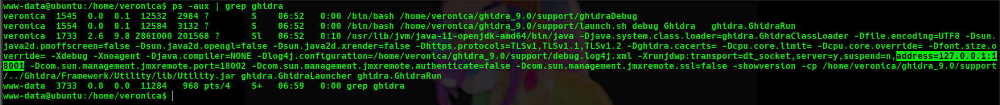

Sabiendo que está corriendo en este puerto lanzamos todo lo que vemos en el enlace de github y listo, hemos conseguido una reverse shell como el usuario Verónica.

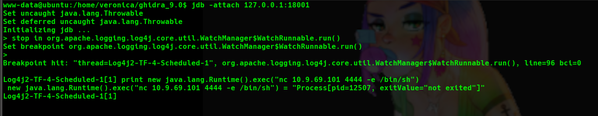

Cogemos la Flag de User y comenzamos la escalada de privilegios.

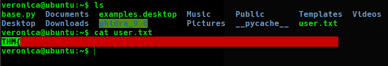

## *# Post-Explotación*
Realizando una enumeración del sistema (en mi caso usé la herramienta LinPeas) encontré que hay un archivo python que podemos ejecutarlo sin password como root, vamos a ver que contiene este archivo.

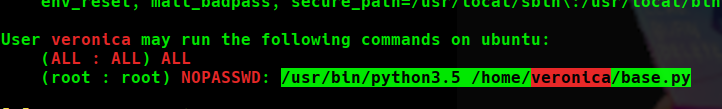


Como vemos en la imagen anterior, es un script sencillo que simplemente encripta en base64 una frase.
> tryhackme is the best

Peeero, está usando la librería "base64", por lo que podemos falsearla. Vamos a ello.  
Creamos un archivo llamado ```"base64.py"``` y colocamos en el nuestra reverse shell en python.

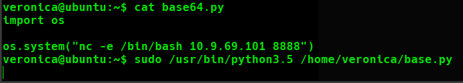

Lo ejecutamos y una vez más...¡Somos ROOT! cogemos nuestra flag de Root y hemos terminado esta maravillosa máquina.

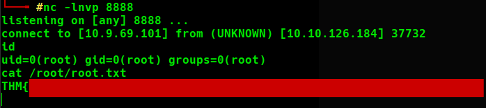
