# DailyBugle WriteUp
Volver al [Indice](../README.md)

Esta vez, traemos una máquina creada por "TryHackMe" directamente, obviamente se encuentra en esta misma plataforma y está catalocada con un nivel de "Hard", aunque vamos a ver que no es complicada...Más bien elaborada.

----------------------------------------------------------------------------------------------------------------------------------------------------------------------
## *# Enumeración*
Vamos a comenzar, para no perder la costumbre, con un escaneo de los puertos, servicios y versiones de estos para ver que tenemos delante.

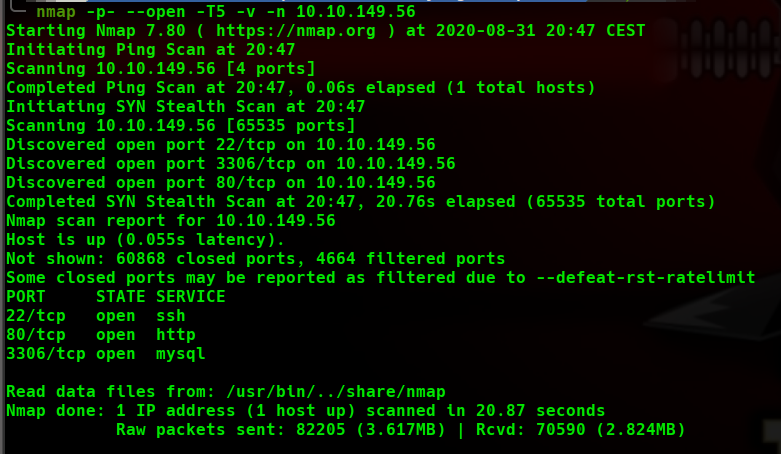
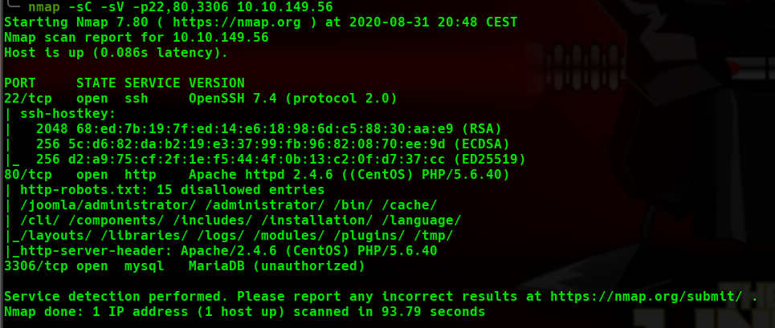

Vemos que tiene 3 puertos abiertos, el 22 de SSH sin nada que nos resalte para ir a por él, el 80 con un apache bajo un SO "CentOS" y muchas entradas "ocultas(disallow)" en el robots.txt, le echamos un ojo pero por ahí no vemos nada.  
Y una base de datos en el puerto 3306 que tampoco nos va a llamar la atención demasiado de momento...

Le echamos un ojo a la versión de Joomla en el archivo "README.txt" y vemos que tiene la versión 3.7, cual es vulnerable a SQLi.

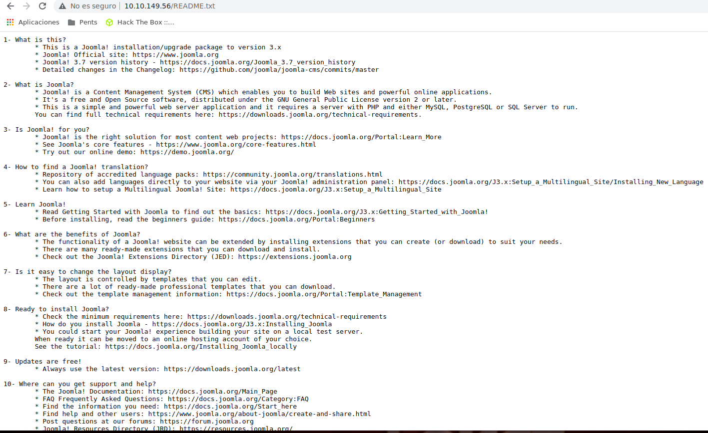

Encontramos un exploit en python en el siguiente enlace que nos saca directamente el usuario y el hash de la pass de este para poder acceder al panel de administración de Joomla.  
[CVE-2017-8917](https://github.com/stefanlucas/Exploit-Joomla)


## *# Explotación*
Lanzamos el exploit con una sintáxis sencilla (script y la URL del servidor Joomla) y listo, ya tenemos la pass.

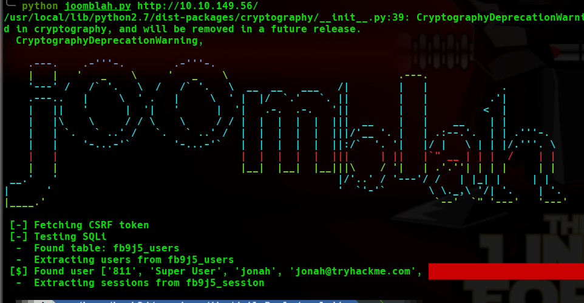

Este script nos saca la pass "Hasheada", así que se lo vamos a pasar a John para que nos la de en texto plano.  
Lo colocamos en un archivo, en mi caso le puse el nombre del usuario delante separado de ":" para que john lo entienda correctamente.  
```john hash --wordlist=/usr/share/wordlists/rockyou.txt```

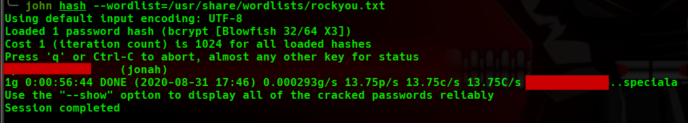

Con las credenciales ya en texto plano completamente nos logueamos en el panel de administrador, colocando "/administrator" detras de la url para acceder a él.

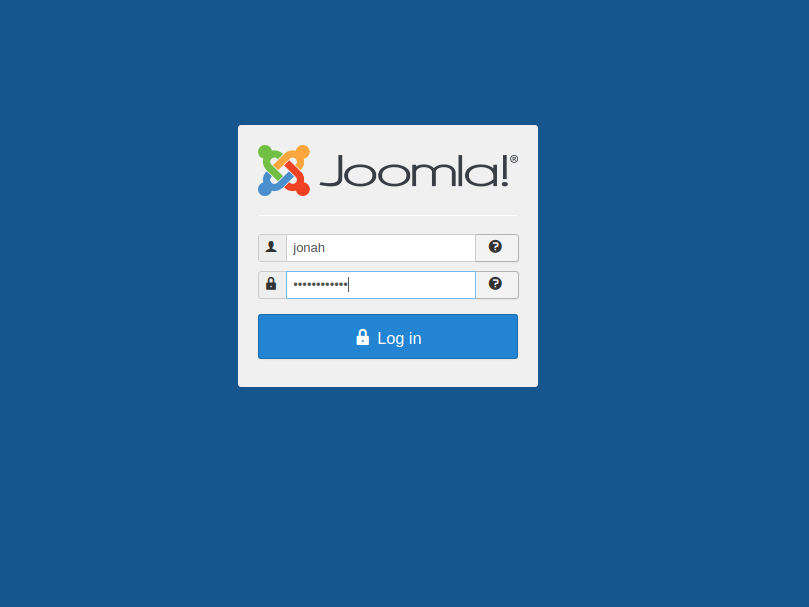

Una vez dentro del panel de administración, nuestro plan es intentar subir una reverse, o sustituir un archivo existente por una reverse en código php, finalmente vamos a realizar lo segundo.  
En mi caso, me dió bastantes problemas al tener varios templates...accedí a la pestaña Manager y luego a Manage de nuevo para desplegar todas las extensiones, buscamos los templates en la columna donde dice "Type", marcamos todas y le damos a "Uninstall", no os preocupéis, el Template por defecto no nos dejará borrarlo y ahora cuando accedamos a los templates solo tendremos uno, así que no habrá pérdida para seleccionar uno u otro.  
En mi caso, modifiqué el archivo "index.php"(no es lo ideal para un entorno real, puede enfadarse nuestro cliente, pero como esto es un entorno controlado no hay problema) y coloqué mi reverse shell en su lugar.

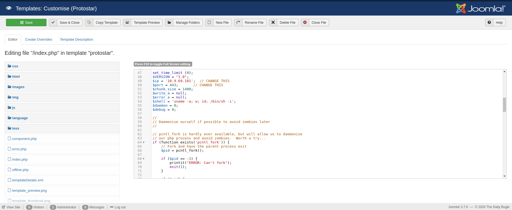

Dejamos nuestra bash en escucha por el puerto que le pusimos a la reverse y listo, estamos dentro, en este caso con el usuario "Apache", un usuario sin privilegios.

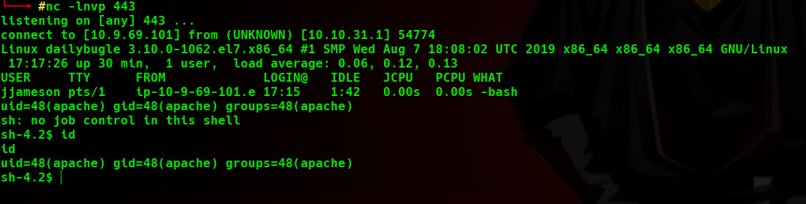


## *# Post-Explotación*
Para poder enumerar el sistema, yo he usado el script llamado [LinPeas.sh](https://github.com/carlospolop/privilege-escalation-awesome-scripts-suite/tree/master/linPEAS).  
Para mi sorpresa, este script de enumeración ha conseguido una contraseña en texto plano (la consigue a través de un archivo de configuración de la base de datos).

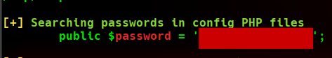

Probamos esta clave con el usuario que encontramos en el directorio home del sistema contra el servicio de SSH y ¡Bingo! estamos dentro con un usuario privilegiado.  
Cogemos la flag de User de su directorio home y comenzamos con la escalación de privilegios.

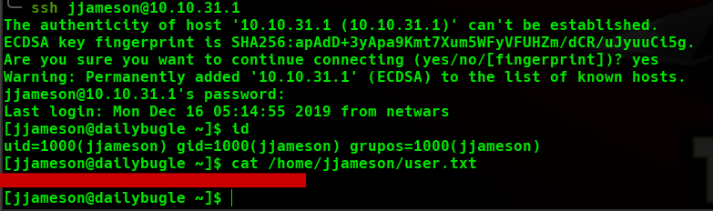

Como siempre suelo realizar al tener contraseña del usuario, vamos a probar el comando ```"sudo -l"``` para ver los privilegios que tiene este como ROOT.  
Vemos que tiene privilegios para ejecutar el comando ```"yum"```. 

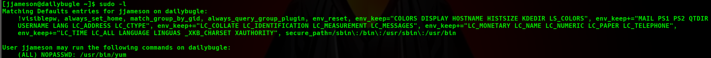

Así que accedemos a [https://gtfobins.github.io/](https://gtfobins.github.io/) y realizamos lo que vemos en la siguiente imagen para poder ser ROOT.

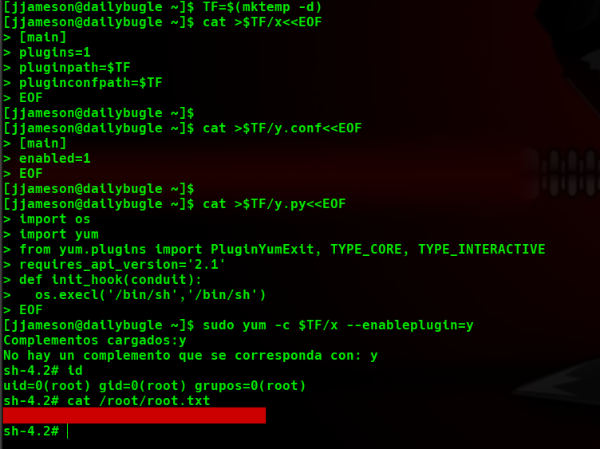

y...somos ¡ROOT!. ¿A que no ha sido tan dificil? 
