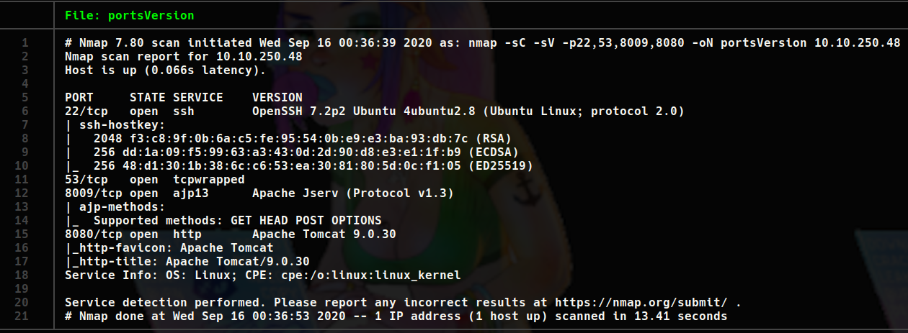
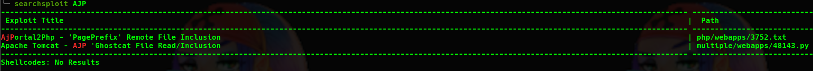
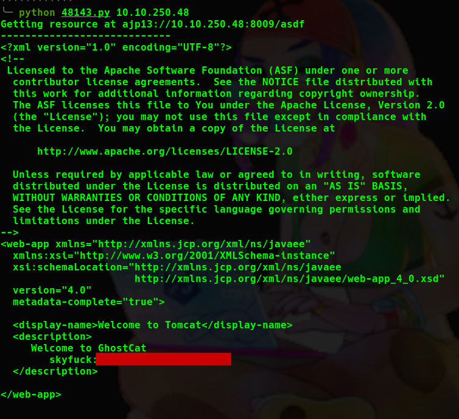
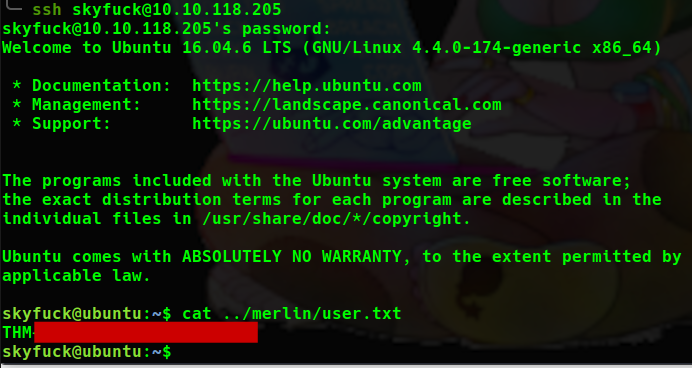
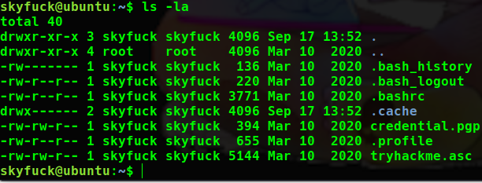
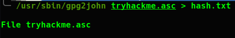
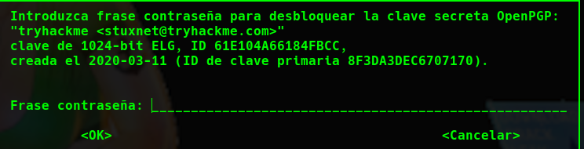
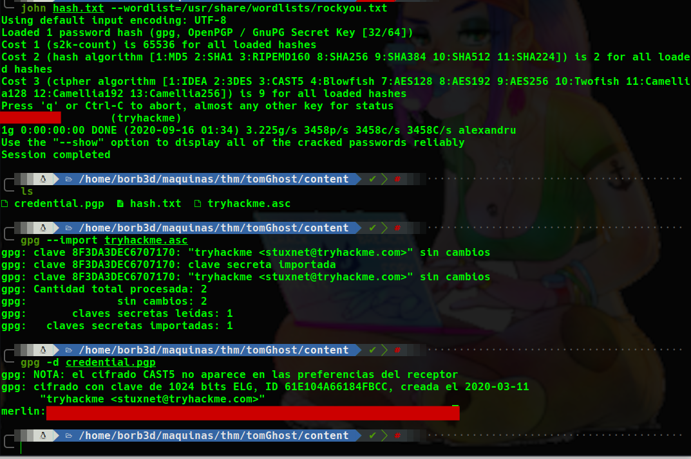
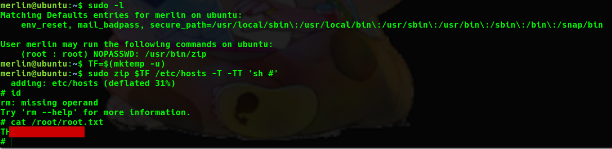

# TomGhost WriteUp
Volver al [Indice](README.md)

Dentro de poco tendremos que recopilar las WriteUps por mes o algo... Decidme como veis mejor que lo recopile.  
Bueno, hoy traemos "TomGhost" otra máquina de nuestro compañero "Stuxnet" pero esta vez, a parte de ser de dificultad "Easy" no me di cuenta que era de él hasta que lo vi en un archivo, jeje

----------------------------------------------------------------------------------------------------------------------------------------------------------------------
## *# Enumeración*
Comenzamos realizando una enumeración de todos los puertos, esta vez os dejo por aquí solo el escaneo de servicios en cada puerto.



Vemos que tiene los puertos:
* 22 => Un SSH normal, sin mucho que explotar.
* 53 => Que no podemos saber que contiene.
* 8009 => Con un apache Jserv.
* 8080 => Un servidor Apache Tomcat.

Buscando vulnerabilidades, con ```"searchsploit"``` encontramos esta vulnerabilidad que nos permite leer un archivo de configuración de la web en el que hay credenciales.



Su usabilidad es muy sencilla, solo necesitamos pasarle la ip objetivo y listo, podremos leer el archivo.



## *# Explotación*
Aquí tenemos las credenciales de la web, las probamos por SSH y correcto, hemos accedido al servidor con el usuario "skyfuck".

Cogemos nuestra flag de user (que la encontramos en el directorio del otro usuario) y vamos a ver como escalar privilegios para el siguiente premio.



## *# Post-Explotación*
Lanzamos el comando ```"sudo -l"``` como de costumbre pero, en este caso, no nos encontramos dentro del fichero "sudoers" por lo que no tenemos privilegios de ROOT.  
Realizamos una enumeración básica del sistema y vemos en el directorio de este usuario 2 archivos, "credential.gpg" y "tryhackme.asc", vamos a abrir ese archivo para ver que contiene (nos lo descargamos en nuestro equipo atacante para trabajar más cómodos).



El archivo está protegido por una contraseña a parte del archivo ".asc", debemos de usar la herramienta ```"gpg2john"``` para pasarlo a un formato que john pueda leer y así aplicarle fuerza bruta.



Ya con nuestro archivo en el "idioma" de john, se lo pasamos fácilmente y sacamos nuestra clave.




Abrimos el archivo, colocamos nuestra "Passphrase" y ya podemos leer el fichero, el cual contiene las credenciales del usuario Merlin.

Ya con el usuario Merlin realizamos el comando ```"sudo -l"``` y, ahora si, podemos ejecutar un archivo binario ```"zip"``` como root y sin contraseña, lo explotamos como siempre siguiendonos de la página [GTFOBins](https://gtfobins.github.io/) y una vez más...¡Somos ROOT!


