# Wonderland WriteUp
Volver al [Indice](README.md)

Esta máquina ha sido creada por "NinjaJc01", tiene una dificultad de "Medium" y decir que, personalmente, me ha encantado la sala. Quizás si tengo que ponerle un pero demasiado cambio de usuario pero en sí muy buena en su totalidad.

----------------------------------------------------------------------------------------------------------------------------------------------------------------------
## *# Enumeración*
Comenzamos como siempre realizando una enumeración de los puertos con nmap, pero, en este caso vamos a variar un poco la sintáxis del primer comando para escanear los puertos ya que me iba demasiado lento.

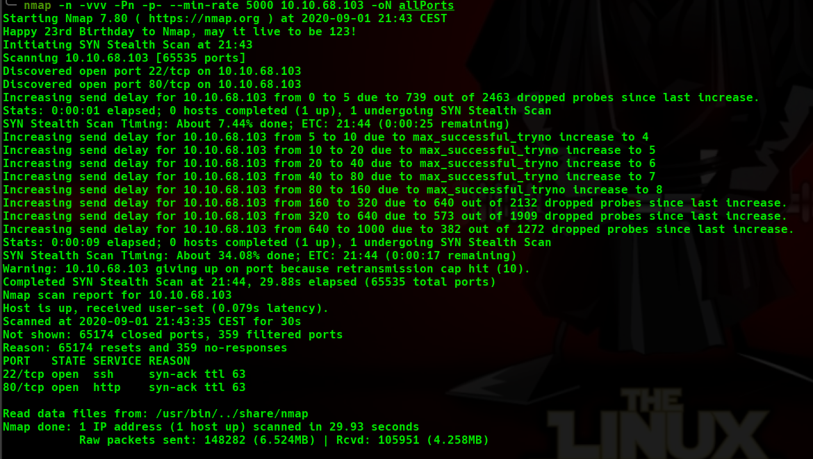
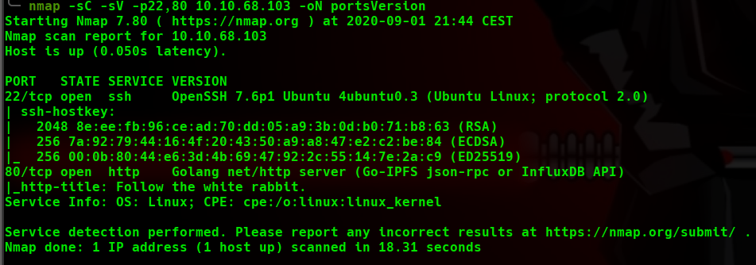

Esta máquina tiene solo el puerto 22 y el 80 abierto y no parece tener demasiadas cosas que buscar solo con esta información, así que accedemos a la web y vemos un pequeño texto sobre el tema "Alicia en el país de las maravillas" y la imagen del conejo. Si examinamos el conejo y analizamos la URL de esta imagen vemos un directorio "img", accedemos a él y vemos 3 imagenes, y 2 de ellas son la misma pero les cambia el color y el formato...curioso.

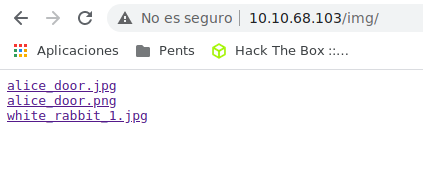

Descargo las 3 imágenes y me pongo a hacerle Steganografía mientras dejo Dirsearch trabajando buscando algún directorio interesante.  
El comando que he usado para hacer la "Stego" ha sido:  
```steghide info "fichero" ```
* Este comando solo te revela si tiene o no algo oculto, para poder extraerlo lo hacemos con el siguiente comando.
* ```steghide extract -sf "fichero"```
  * extract => Para extraer lo que tiene
  * -sf => Escribe el resultado en el "nombre" del archivo.

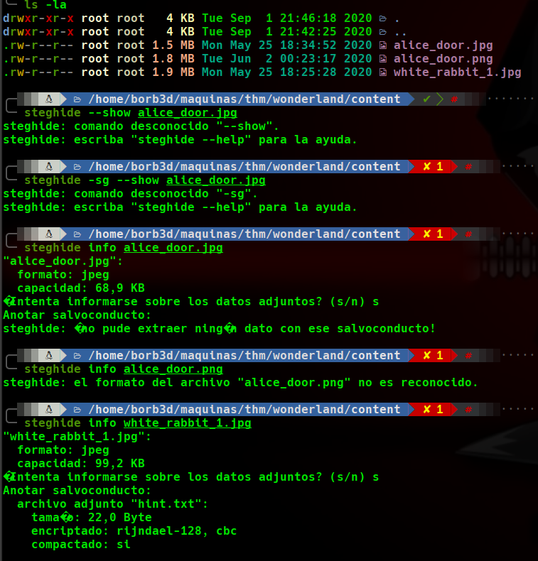

Como vemos, hemos encontrado un fichero .txt dentro de una de las imágenes (la principal), así que lo extraemos con el comando que he dejado justo antes y abrimos el archivo a ver que contiene.

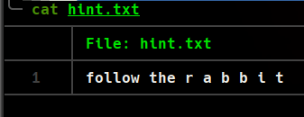
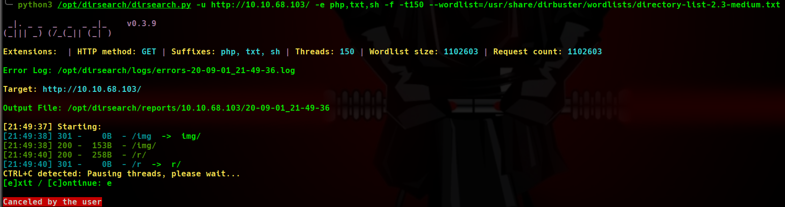

Dejo arriba también la imagen de la búsqueda con dirsearch ya que al leer esta "pista" y ver que dirsearch había sacado un directorio solo con la letra "r", no necesito saber más.  
Accedo a este directorio "r" y aparece este texto.
<Would you tell me, please, which way I ought to go from here?

Lo que me hace pensar...tengo que colocar cada letra de la pista en un directorio hasta crear la palabra.

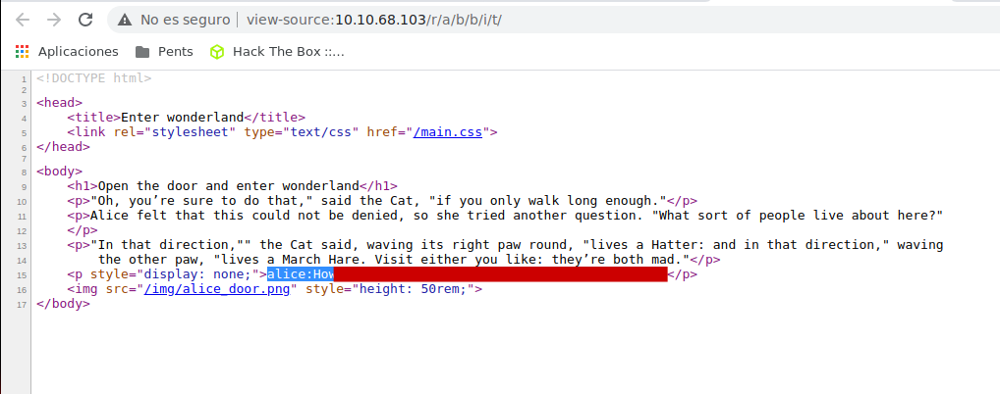

## *# Explotación*
En el código fuente de esta nueva página hemos encontrado las credenciales en texto plano de uno de los usuarios, accedemos vía SSH y como vemos en la imagen que dejo a continuación, en el directorio home de este usuario, ¿está la flag de root?, y veo que en la "ayuda" de la flag de user dice.
<Everything is upside down here.

Así que intento buscar la flag de user en el directorio de root y ¡perfecto!, tenemos la flag de User.

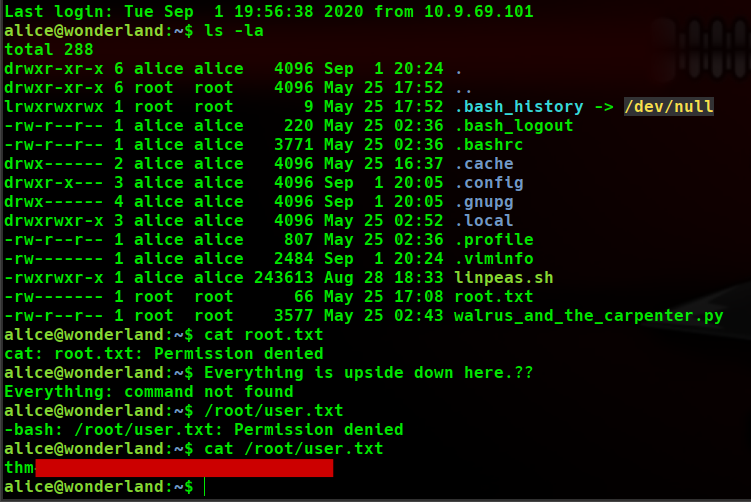

## *# Post-Explotación*
Como siempre, comprobamos los permisos que tiene este usuario como root con el comando ```"sudo -l"``` y vemos que tiene privilegios de ejecutar un archivo de python3.6 con el usuario "rabbit", así que entendemos que antes de root debemos de cambiar de usuario.  
Le echamos un vistazo rápido al fichero y vemos que hace uso de la librería "random", así que vamos a crear una librería falsa para que cuando lo ejecutemos, use la librería falsa que hemos creado.

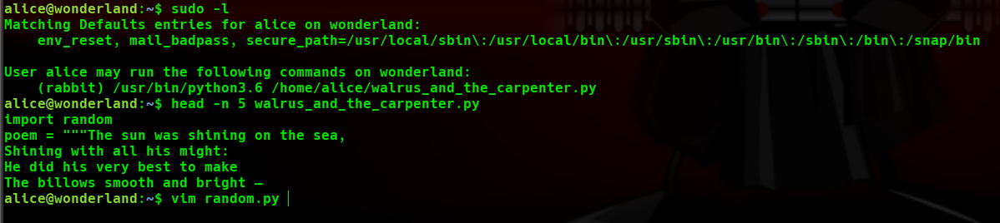

Para crear esta "librería falsa" lo único que debemos hacer es:
* Crear en el directorio que está el programa un archivo con el nombre de la librería que usa con la extensión ".py".
* Agregarle el código que queremos que ejecute.
* Darle permisos de ejecución "chmod +x"

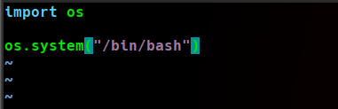

Ejecutamos el comando tal como vemos en la imagen (con las rutas absolutas) para que sea ejecutado con los privilegios de ese usuario y listo, hemos cambiado de usuario.

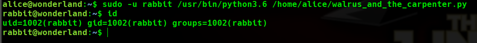

Vamos al directorio de este nuevo usuario y vemos que hay un archivo con SUID, así que vamos a ejecutarlo a ver que hace.

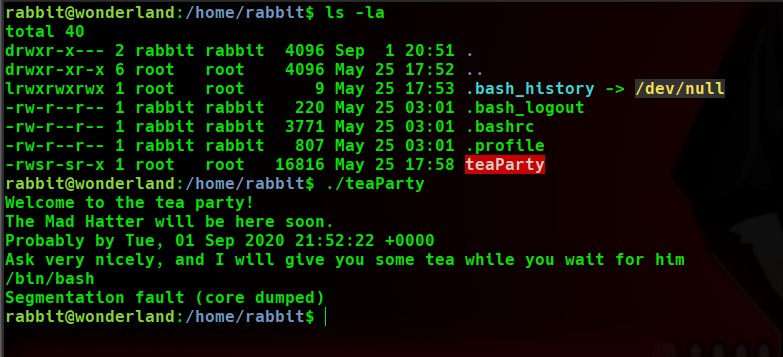

Según vemos solo saca un texto con la hora actual, se queda parado (intentamos sacar una bash ahí por probar algo) y luego salta el "error" y se acaba el programa.  

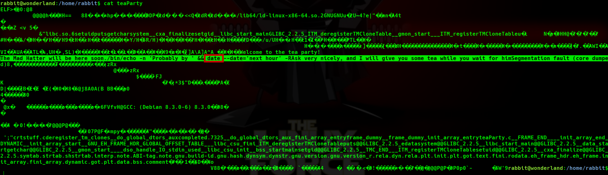

Examinamos más a fondo el programa y vemos que el comando para sacar la hora no tiene ruta absoluta así que...PATH hijacking de nuevo, solo que esta vez, debemos modificar el path para que coja primero el directorio que le digamos.  
* Modificar el PATH: export PATH="directorio que queramos":$PATH

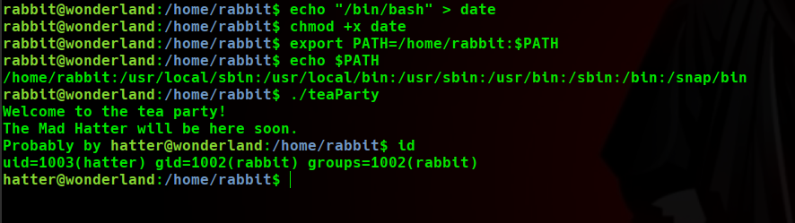

Ejecutamos ahora sí, el programa llamado "TeaParty" de nuevo y listo, ahora somos el usuario "hatter", échamos un ojo a su directorio y vemos un archivo llamado "password.txt" con la pass de este usuario, así que accedemos por ssh para trabajar mejor.  
Ejecutamos nuevamente el comando ```"sudo -l"``` y vemos que este usuario no se encuentra en el archivo "sudoers" por lo que no puede ejecutar este comando...(¿hemos descendido de privilegios?).

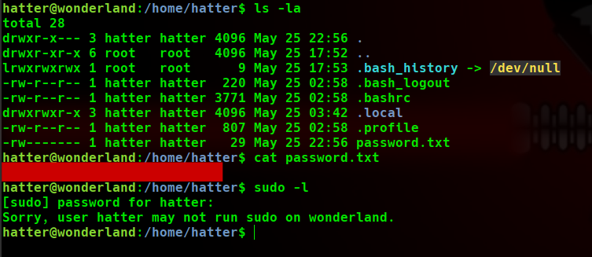

Pienso...(no hemos realizado todo esto para descender...algo tiene que haber)así que realizo una enumeración del sistema y encuentro que, el comando ```"/usr/bin/perl"``` tiene "capabilities" para ejecutarse como ROOT...y se lo que pensáis (¿podríamos habernos aprovechado de esto con el primer usuario que conseguimos?)pero NO, no tenían permisos para ejecutar ```"/usr/bin/perl"```.  
Realizamos una búsqueda por Google para encontrar como aprovecharnos de esto (la verdad no me manejo con "perl") y encuentro un artículo que lo deja bien facilito.  
[Privesc Capabilities Perl](https://www.hackingarticles.in/linux-for-pentester-perl-privilege-escalation/#:~:text=Capabilities%20in%20Privilege%20Escalation&text=Capabilities%20are%20those%20permissions%20that,to%20perform%20specific%20privileged%20tasks.)

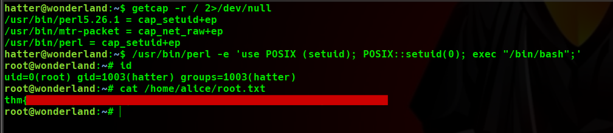

Lo ejecutamos y...¡Somos ROOT!, cogemos nuestro premio y hemos acabado esta sala.